```mermaid
%%{init: {'theme': 'dark', 'themeVariables': { 'primaryColor': '#2dd4bf', 'edgeLabelBackground':'#134e4a', 'nodeTextColor':'#e0f2f1', 'fontFamily':'Inter', 'nodeBorderRadius':'12px', 'clusterBorderRadius':'16px', 'secondaryColor':'#5eead4', 'tertiaryColor':'#99f6e4', 'lineColor':'#5eead4'}}}%%
flowchart TD
    subgraph Server["Server"]
        direction TB
        Caddy["🔐 Caddy (TLS/Proxy)"]
        Element["💬 Element Web"]
        Synapse["🧠 Synapse (Matrix)"]
        PostgreSQL["🐘 PostgreSQL"]
        Redis["⚡ Redis Cache"]
        Coturn["🔁 Coturn (TURN)"]
        LiveKit["📡 LiveKit (SFU)"]
    end
    User["👤 User"]
    User ---|TLS| Caddy
    Caddy --- Synapse
    Caddy --- Element
    Caddy --- LiveKit
    Caddy --- Coturn
    Synapse --- PostgreSQL
    Synapse --- Redis
    Synapse --- LiveKit
    classDef teal fill:#2dd4bf,stroke:#5eead4,stroke-width:2px,color:#e0f2f1,rx:12px;
    classDef mint fill:#134e4a,stroke:#5eead4,stroke-width:2px,color:#e0f2f1,rx:12px;
    class Caddy,Synapse,Element teal;
    class PostgreSQL,Redis,LiveKit,Coturn mint;
    class User mint;
    style Server stroke:#5eead4,stroke-width:4px,rx:16px,fill:#0f172a;
    style User stroke:#5eead4,stroke-width:2px,rx:12px;

```

# 💊 MED-kit (Matrix Easy Deploy)

An easy way to deploy your own [Matrix](https://matrix.org) homeserver.

One script. A few questions. Your own corner of the internet and the ability to federate. 

> ### Powered by awesome OSS technologies:
<table align="center"><tr>
  <td align="center"></td>
  <td align="center"></td>
  <td align="center"></td>
  <td align="center"></td>
  <td align="center"></td>
  <td align="center"></td>
</tr></table>

### System overview:



---

## What you get

After running `setup.sh` you'll have a working Matrix homeserver — the whole stack, containerised and wired together:


| Service | What it does |
|---------|-------------|
|  **[Synapse](https://github.com/element-hq/synapse)** | The Matrix homeserver. Handles federation, rooms, messages. |
|  **[Element Web](https://github.com/element-web/element-web)** | The web client. Served at your domain so anyone can log in from a browser. |
|  **[Caddy](https://caddyserver.com)** | Reverse proxy. Handles TLS automatically via Let's Encrypt. |
|  **PostgreSQL** | Database for Synapse. Considerably more robust than SQLite for anything beyond a toy. |
|  **Redis** | Shared cache/event store for modules (Hookshot E2EE now, others later). |
| **[coturn](https://github.com/coturn/coturn)** | TURN server. Relays WebRTC traffic for 1:1 voice and video calls when both sides are behind NAT. |
|  **[LiveKit](https://livekit.io)** | SFU (Selective Forwarding Unit). Powers group video calls via Element Call and MatrixRTC. |

Everything runs in Docker Compose. Caddy manages your TLS certificate without you lifting a finger.

---

## Why does this exist?

Self-hosting Matrix is genuinely powerful — you own your conversations, your data, your server rules. But the official documentation assumes you already know what a reverse proxy is and why you might need one, and a fair bit of patience for YAML.

This project makes the first step easier. It doesn't abstract away the details — it sets things up correctly and then gets out of your way, so you can see exactly what's running and why.

---

## Requirements

- **A Linux server** with a public IP address (a cheap VPS works fine)
- **A domain name** pointed at that server (e.g. `matrix.example.com` → your server's IP)
- **Docker** (Engine 24+ recommended) — [install guide](https://docs.docker.com/engine/install/)
- **Docker Compose v2** — comes bundled with recent Docker Desktop and Docker Engine
- `curl`, `openssl`, `python3` — standard on most distributions

> **DNS first.** Make sure your DNS A record is live before running setup. Caddy needs to reach Let's Encrypt to issue your certificate, and that requires your domain to already be resolving.

---

## Quick start

```bash
git clone https://github.com/nordwestt/matrix-easy-deploy-kit
cd matrix-easy-deploy-kit
bash setup.sh
```

The wizard will ask you:

1. **Your Matrix domain** — something like `matrix.example.com`
2. **Your server name** — appears in Matrix IDs like `@you:example.com` (defaults to the base domain)
3. **Admin username and password**
4. Whether to allow public registration
5. Whether to enable federation
6. Whether to install Element Web, and on which domain
7. **Your LiveKit domain** — something like `livekit.example.com` (defaults to `livekit.<basedomain>`)

Everything else — database passwords, signing keys, TURN secrets, LiveKit API keys, internal secrets — is generated automatically. The wizard also auto-detects your server's public IP for coturn's NAT traversal configuration.

---

## Project layout

```
matrix-easy-deploy/
│
├── setup.sh                      # The wizard. Start here.
├── start.sh                      # Bring everything back up
├── stop.sh                       # Bring everything down (data is preserved)
├── update.sh                     # Pull latest images and restart
│
├── caddy/
│   ├── docker-compose.yml        # Caddy service definition
│   ├── Caddyfile.template        # Routing template (rendered during setup)
│   └── Caddyfile                 # Generated — do not edit by hand
│
├── modules/
│   ├── core/                     # The core Matrix stack
│   │   ├── docker-compose.yml    # Synapse + Element + PostgreSQL + shared Redis
│   │   ├── synapse/
│   │   │   ├── homeserver.yaml.template
│   │   │   ├── homeserver.yaml   # Generated during setup
│   │   │   └── log.config
│   │   └── element/
│   │       ├── config.json.template
│   │       └── config.json       # Generated during setup
│   ├── calls/                    # Voice and video calling stack
│   │   ├── docker-compose.yml    # coturn + LiveKit
│   │   ├── coturn/
│   │   │   ├── turnserver.conf.template
│   │   │   └── turnserver.conf   # Generated during setup
│   │   └── livekit/
│   │       ├── livekit.yaml.template
│   │       └── livekit.yaml      # Generated during setup
│   └── hookshot/                 # Hookshot bridge (webhooks, GitHub, feeds…)
│       ├── docker-compose.yml    # Hookshot service definition
│       ├── setup.sh              # Module setup wizard
│       └── hookshot/
│           ├── config.yml.template
│           ├── config.yml        # Generated during module setup
│           ├── registration.yml.template
│           ├── registration.yml  # Generated during module setup
│           └── passkey.pem       # Generated during module setup (keep private)
│
└── scripts/
    ├── lib.sh                    # Shared shell utilities
    └── create-admin.sh           # Admin user registration helper
```

Modules live in `modules/`. The core stack is itself a module — bridges, bots, and other additions will each have their own directory under `modules/` with their own `docker-compose.yml` and `setup.sh`.

Redis is provisioned once in `modules/core` and exposed as a shared internal dependency (`matrix_redis`) so optional modules can reuse it without spinning up duplicate Redis containers.

By default, modules should use `SHARED_REDIS_URL` from `.env` and keep separation via Redis DB indexes and/or key prefixes.

### Redis conventions (tiny guide)

- **Single shared Redis**: use the core Redis instance (`matrix_redis`) unless a module has strict isolation needs.
- **Per-module DB index**: assign each module its own DB index (e.g. Hookshot uses `/1`, future modules can use `/2`, `/3`, ...).
- **Key prefixing**: if a module shares a DB, prefix keys with `<module>:` to avoid collisions.
- **Env-first wiring**: modules should read `SHARED_REDIS_URL` and derive module-specific URLs in their setup script.
- **Escalation rule**: split to dedicated Redis only when a module needs separate durability/SLO or creates noisy-neighbor risk.

---

## Common operations

**View logs**
```bash
docker logs -f matrix_synapse
docker logs -f caddy
docker logs -f matrix_element
docker logs -f matrix_postgres
docker logs -f matrix_redis
docker logs -f matrix_livekit
docker logs -f matrix_coturn
docker logs -f matrix-hookshot  # if hookshot module is installed
```

**Create a user account (interactive)**
```bash
bash scripts/create-user.sh
```

The helper asks for a username, generates a secure temporary password by default (or lets you set a custom one), and can optionally grant admin privileges.

**Stop all services** (data stays intact in Docker volumes)
```bash
bash stop.sh
```

**Start all services**
```bash
bash start.sh
```

**Update images to the latest release**
```bash
bash update.sh
```

**Reload Caddy after editing the Caddyfile**
```bash
docker exec caddy caddy reload --config /etc/caddy/Caddyfile
```

---

## Re-running setup

If you need to change your domain or reconfigure anything, you can re-run `setup.sh`. It will regenerate all config files and restart services. If you already have data you want to preserve, stop first:

```bash
bash stop.sh
bash setup.sh
```

> Secrets (database password, signing keys, TURN shared secret, LiveKit API key, etc.) are re-generated each time you run setup. If you want to preserve an existing database, back it up first, or manually edit `.env` and the config files instead of re-running setup.

---

## Adding modules

The project is designed to grow. Each optional component (a bridge to Discord, a Telegram bridge, a bot framework) lives in its own module under `modules/`. When a module is ready, you enable it with:

```bash
bash setup.sh --module <module-name>
```

This calls the module's own `setup.sh`, which can ask its own questions, pull its own images, and register itself with the rest of the stack without touching the core configuration.

### Available modules

#### `hookshot` — Bridges, webhooks, and feeds

[Hookshot](https://matrix-org.github.io/matrix-hookshot/latest/hookshot.html) connects your Matrix rooms to external services. Out of the box it enables:

| Feature | How to use |
|---------|------------|
| **Generic webhooks** | Invite `@hookshot` to a room, run `!hookshot webhook <name>` to get an inbound URL |
| **RSS/Atom feeds** | `!hookshot feed <url>` — posts new items to the room |
| **Encrypted rooms (E2EE)** | Supported out of the box (Hookshot crypto store + Redis cache + Synapse MSC3202/MSC2409 flags) |
| **GitHub** (optional) | Configure `github:` block in `config.yml`, re-run or restart |
| **GitLab** (optional) | Configure `gitlab:` block in `config.yml` |
| **Jira** (optional) | Configure `jira:` block in `config.yml` |

```bash
bash setup.sh --module hookshot
```

The wizard will ask for a webhook domain (e.g. `hookshot.example.com`), generate the appservice tokens and RSA passkey, register Hookshot with Synapse, add a Caddy site block, and start the container automatically.

**DNS required:** add an A record for your hookshot domain before running the wizard.

**After setup:**
```bash
# View logs
docker logs -f matrix-hookshot

# Enable GitHub / GitLab / Jira — edit config.yml then:
docker restart matrix-hookshot
```

If you installed Hookshot before encrypted-room support was added, run `bash setup.sh --module hookshot` once more to apply the new Redis and Synapse compatibility settings.

**Diagnose wiring issues** (checks registration, tokens, network, and does a live Synapse→Hookshot ping):
```bash
bash scripts/hookshot-check.sh
```

**Command caveats (common gotchas):**
- Room commands (`!hookshot ...`) require an unencrypted room unless Hookshot encryption support is configured.
- Give `@hookshot` enough power in the room (typically Moderator / PL50) so it can write room state.
- In DMs, `help` may look sparse if you have only webhooks/feeds enabled and no GitHub/GitLab/Jira auth features configured.

More modules coming. Watch this space.

---

## Troubleshooting

**Caddy can't get a certificate**

Usually a DNS issue. Check that your domain resolves to your server's IP:
```bash
dig +short matrix.example.com
```
If it doesn't match, wait for DNS to propagate and try again. Caddy logs all certificate activity:
```bash
docker logs caddy
```

**1:1 calls fail or audio/video cuts out**

This is almost always a TURN / NAT traversal issue. Check that ports 3478 and 5349 (as well as the UDP relay range 49152–49400) are open in your firewall or VPS security group. Verify coturn is running:
```bash
docker logs matrix_coturn
```
If your VPS is behind a cloud NAT (e.g. AWS, GCP), make sure `external-ip` in `modules/calls/coturn/turnserver.conf` is set to your actual public IP, not the NAT gateway IP.

**Group calls (Element Call) don't connect**

Check that LiveKit is running and that your `livekit.example.com` DNS record is resolving:
```bash
docker logs matrix_livekit
curl -I https://livekit.example.com
```
Also make sure port range 50000–50200/UDP is open in your firewall.

**Synapse takes a long time to start**

On first boot, Synapse runs database migrations. If your VPS is modest, give it a minute or two. The setup wizard polls every 5 seconds and will wait up to 3 minutes.

**The admin user wasn't created**

If Synapse wasn't responding in time, the wizard prints the manual command:
```bash
bash scripts/create-admin.sh \
    https://matrix.example.com \
    <your_registration_shared_secret> \
    admin \
    <your_password>
```
The `REGISTRATION_SHARED_SECRET` is in your `.env` file.

**Synapse reports database connection errors**

Make sure the `matrix_postgres` container is healthy before Synapse tries to connect. You can check:
```bash
docker inspect matrix_postgres | grep -A 5 Health
```

---

## Security notes

- Your `.env` file contains database credentials, TURN secrets, LiveKit API keys, and other internal secrets. It's in `.gitignore` — keep it that way.
- Public registration is off by default. Think carefully before turning it on; an open Matrix server is a spam target.
- Federation is on by default. If you want a private, islands-only server, disable it during setup.
- The Synapse admin API (`/_synapse/admin/`) is accessible via Caddy. It requires a valid admin access token to use — the setup just exposes the routing; auth is Synapse's business.
- coturn runs with `network_mode: host` so it can bind UDP relay ports directly. Ensure your firewall allows:
  - TCP/UDP 3478 (TURN)
  - TCP/UDP 5349 (TURN over TLS)
  - UDP 49152–49400 (TURN relay range)
  - UDP 50000–50200 (LiveKit WebRTC media)

---

## Contributing

Issues, fixes, and module contributions are welcome. If you're adding a new module, follow the pattern in `modules/core/` — a `docker-compose.yml` for services and a `setup.sh` that sources `scripts/lib.sh` for prompts and helpers.

---

## Licence

MIT. Do what you like with it.
