# 💊 MED-kit: The cure to your matrix deployment headaches

An easy way to deploy your own [Matrix](https://matrix.org) homeserver with reasonable defaults.

One script. A few questions. Your own communication infrastructure with the ability to federate. 

> ### Powered by awesome OSS technologies:
<table align="center"><tr>
  <td align="center"></td>
  <td align="center"></td>
  <td align="center"></td>
  <td align="center"></td>
  <td align="center"></td>
  <td align="center"></td>
</tr></table>


---

## ✨ What you get from the wizard

```mermaid
%%{init: {'theme': 'dark', 'themeVariables': { 'primaryColor': '#2dd4bf', 'edgeLabelBackground':'#134e4a', 'nodeTextColor':'#e0f2f1', 'fontFamily':'Inter', 'nodeBorderRadius':'12px', 'clusterBorderRadius':'16px', 'secondaryColor':'#5eead4', 'tertiaryColor':'#99f6e4', 'lineColor':'#5eead4'}}}%%
flowchart TD
    subgraph Server["Server"]
        direction TB
        Caddy["🔐 Caddy (TLS/Proxy)"]
        Element["💬 Element Web"]
        Synapse["🧠 Synapse (Matrix)"]
        PostgreSQL["🐘 PostgreSQL"]
        Redis["⚡ Redis Cache"]
        Coturn["🔁 Coturn (TURN)"]
        LiveKit["📡 LiveKit (SFU)"]
    end
    User["👤 User"]
    User ---|TLS| Caddy
    Caddy --- Synapse
    Caddy --- Element
    Caddy --- LiveKit
    Caddy --- Coturn
    Synapse --- PostgreSQL
    Synapse --- Redis
    Synapse --- LiveKit
    classDef teal fill:#2dd4bf,stroke:#5eead4,stroke-width:2px,color:#e0f2f1,rx:12px;
    classDef mint fill:#134e4a,stroke:#5eead4,stroke-width:2px,color:#e0f2f1,rx:12px;
    class Caddy,Synapse,Element teal;
    class PostgreSQL,Redis,LiveKit,Coturn mint;
    class User mint;
    style Server stroke:#5eead4,stroke-width:4px,rx:16px,fill:#0f172a;
    style User stroke:#5eead4,stroke-width:2px,rx:12px;

```



After running `matrix-wizard.sh` you'll have a working Matrix homeserver — the whole stack, containerised and wired together:


| Service | What it does |
|---------|-------------|
|  **[Synapse](https://github.com/element-hq/synapse)** | The Matrix homeserver. Handles federation, rooms, messages. |
|  **[Element Web](https://github.com/element-web/element-web)** | The web client. Served at your domain so anyone can log in from a browser. |
|  **[Caddy](https://caddyserver.com)** | Reverse proxy. Handles TLS automatically via Let's Encrypt. |
|  **PostgreSQL** | Database for Synapse. Considerably more robust than SQLite for anything beyond a toy. |
|  **Redis** | Shared cache/event store for modules (Hookshot E2EE now, others later). |
| **[coturn](https://github.com/coturn/coturn)** | TURN server. Relays WebRTC traffic for 1:1 voice and video calls when both sides are behind NAT. |
|  **[LiveKit](https://livekit.io)** | SFU (Selective Forwarding Unit). Powers group video calls via Element Call and MatrixRTC. |

Everything runs in Docker Compose. Caddy manages your TLS certificate without you lifting a finger.

> ### 🔐 Bring your own login: Google, Microsoft, Github and more
>
> <table align="center">
>   <tr>
>     <td align="center"></td>
>     <td align="center"></td>
><td align="center"></td>
>   </tr>
> </table>
>
> The setup wizard currently supports **OIDC/OAuth2 SSO** out of the box — so users can sign in with **Google**, **Microsoft Entra ID**, or any other **OIDC-compatible provider**.

> ### 🔗 Bridge to other platforms: Whatsapp, Slack and more
>
> <table align="center">
>   <tr>
>     <td align="center"></td>
>     <td align="center"></td>
>     <td align="center"></td>
>   </tr>
> </table>
>
> The wizard supports auto-setup of **Whatsapp**, but you can add more bridges manually through [following the documentation](https://docs.mau.fi/bridges). Keep an eye on this project for auto-setup of more bridges in future releases.


---

## Why does this exist?

Self-hosting Matrix is genuinely powerful — your own conversations, data, and server rules. But many "easy" setups expect you to:
- know what a reverse proxy is
- have a fair bit of patience for YAML
- copy environment variables and secrets around

This project makes setup even easier. It doesn't take power away from you — but rather sets things up correctly and then gets out of your way, so you can see exactly what's running and why.

---

## Requirements

- **A Linux server** with a public IP address (a cheap VPS works fine)
- **A domain name** pointed at that server (e.g. `matrix.example.com` → your server's IP)
- **Docker** (Engine 24+ recommended) — [install guide](https://docs.docker.com/engine/install/)
- **Docker Compose v2** — comes bundled with recent Docker Desktop and Docker Engine
- `curl`, `openssl`, `python3` — standard on most distributions

> **DNS first.** Make sure your DNS A record is live before running setup. Caddy needs to reach Let's Encrypt to issue your certificate, and that requires your domain to already be resolving.

---

## Quick start

```bash
git clone https://github.com/nordwestt/matrix-easy-deploy-kit
cd matrix-easy-deploy-kit
bash matrix-wizard.sh
```

`matrix-wizard.sh` now opens an interactive operator wizard where you can:
- run first-time setup,
- install/configure modules,
- create users/admins,
- start/stop/update services,
- and tail logs.

If you want to jump straight into first-time setup without the menu:

```bash
bash matrix-wizard.sh --full-setup
```

The wizard will ask you:

1. **Your Matrix domain** — something like `matrix.example.com`
2. **Your server name** — appears in Matrix IDs like `@you:example.com` (defaults to the base domain)
3. **Admin username and password**
4. Whether to allow public registration
5. Whether to enable federation
6. Whether to enable SSO (OIDC/OAuth2)
7. If SSO is enabled: one or more providers (loop: add provider, then optionally add another)
8. For each provider: name, issuer URL, client ID, client secret
9. For each provider: whether unknown users can auto-register via that provider
10. For each provider: optional OIDC claim allowlist (org/group/domain control)
11. Whether to install Element Web, and on which domain
12. **Your LiveKit domain** — something like `livekit.example.com` (defaults to `livekit.<basedomain>`)

### Important: `MATRIX_DOMAIN` vs `SERVER_NAME`

- `MATRIX_DOMAIN` is where the homeserver API is hosted (for example `matrix.example.com`).
- `SERVER_NAME` is the Matrix identity domain in MXIDs (for example `@alice:example.com`).

If these are different, federation discovery still starts from `SERVER_NAME`, so DNS for **both** names must point to this host (or `SERVER_NAME` must otherwise serve `/.well-known/matrix/*` that delegates to your homeserver).

This project now generates Caddy config that serves Matrix endpoints on both hostnames automatically.

Everything else — database passwords, signing keys, TURN secrets, LiveKit API keys, internal secrets — is generated automatically. The wizard also auto-detects your server's public IP for coturn's NAT traversal configuration.

## SSO (OIDC / OAuth2)

This project configures Synapse `oidc_providers`, which works with Google and other OIDC-compatible identity providers.

During setup (default: enabled), provide:
- Provider display name (for login UI)
- OIDC issuer URL (Google: `https://accounts.google.com/`)
- OIDC client ID
- OIDC client secret
- Whether SSO can auto-register unknown users (default: **Yes** for frictionless onboarding)
- Optional claim allowlist (default: off; enable when you need tighter control)

You can configure multiple providers in one run (for example Google + Okta + Authentik).

When creating the OIDC app in your identity provider, set the redirect/callback URL to:

```text
https://<your-matrix-domain>/_synapse/client/oidc/callback
```

Example for Google:
- Create an OAuth client in Google Cloud Console
- Add the callback URL above as an authorized redirect URI
- Paste client ID + client secret into the setup wizard

### Restrict who can sign in (important)

To avoid “any Google user can join”, use one or both controls in the setup wizard:

1. Enable **Restrict SSO to specific OIDC claim values**
  - Result: only identities with matching claims are accepted by Synapse (`attribute_requirements`).
2. Set **Allow NEW users to auto-register via SSO?** to `No` (strict mode)
  - Result: only users you pre-create on Synapse can log in via SSO.

Common examples:

- **Google Workspace org only**: claim `hd`, allowed value `yourcompany.com`
- **Group allowlist**: claim `groups`, allowed value(s) like `matrix-users,admins`

How matching works in this setup:
- If you enter one allowed value, Synapse gets `value` matching.
- If you enter multiple comma-separated values, Synapse gets `one_of` matching.
- Matching is exact.

Generated behavior (conceptually):
- claim=`hd`, values=`acme.com` → `attribute_requirements: [{attribute: hd, value: acme.com}]`
- claim=`groups`, values=`matrix-users,admins` → `attribute_requirements: [{attribute: groups, one_of: [matrix-users, admins]}]`

### OIDC claim examples (what they do)

- `hd` (Google Workspace hosted domain)
  - Typical value: `yourcompany.com`
  - Use when: you only want users from your Google Workspace domain.
- `groups` (group membership; provider-specific)
  - Typical values: `matrix-users`, `admins`
  - Use when: you want role/group-based access control.
- `email`
  - Typical value: `alice@yourcompany.com`
  - Use when: you want a strict allowlist for specific email addresses.
- `tid` (Microsoft Entra tenant ID)
  - Typical value: tenant UUID
  - Use when: you only want users from one Entra tenant.
- `preferred_username` (provider-specific username/login)
  - Typical value: `alice`
  - Use when: provider issues stable usernames and you want to allow specific ones.

Notes:
- Group-based restrictions only work if your IdP actually includes group claims in OIDC userinfo/token.
- Claim matching is exact (or one-of exact values), so use the exact value your provider emits.
- Some claims (especially `groups`) may require extra scopes/provider config. This setup requests `openid profile email` by default.
- If your IdP already restricts users at the provider level (for example, Google OAuth app set to your org only), the default auto-registration flow is usually a good UX/security balance.

### Pre-creating approved users (what this means)

Pre-creating means creating local Matrix accounts in advance (for approved people only), then letting SSO users log into those existing accounts.

Advantages:
- Prevents surprise account creation from any user who can pass IdP login.
- Gives tighter onboarding control (who gets access and when).
- Lets you combine IdP checks + explicit local account approval for defense in depth.

Use the helper to create approved accounts:

```bash
bash scripts/create-user.sh
```

You can disable SSO in the wizard if you only want local Matrix passwords.

---

## Project layout

```
matrix-easy-deploy/
│
├── matrix-wizard.sh                      # The wizard. Start here.
├── start.sh                      # Bring everything back up
├── stop.sh                       # Bring everything down (data is preserved)
├── update.sh                     # Pull latest images and restart
│
├── caddy/
│   ├── docker-compose.yml        # Caddy service definition
│   ├── Caddyfile.template        # Routing template (rendered during setup)
│   └── Caddyfile                 # Generated — do not edit by hand
│
├── modules/
│   ├── core/                     # The core Matrix stack
│   │   ├── docker-compose.yml    # Synapse + Element + PostgreSQL + shared Redis
│   │   ├── synapse/
│   │   │   ├── homeserver.yaml.template
│   │   │   ├── homeserver.yaml   # Generated during setup
│   │   │   └── log.config
│   │   └── element/
│   │       ├── config.json.template
│   │       └── config.json       # Generated during setup
│   ├── calls/                    # Voice and video calling stack
│   │   ├── docker-compose.yml    # coturn + LiveKit
│   │   ├── coturn/
│   │   │   ├── turnserver.conf.template
│   │   │   └── turnserver.conf   # Generated during setup
│   │   └── livekit/
│   │       ├── livekit.yaml.template
│   │       └── livekit.yaml      # Generated during setup
│   ├── hookshot/                 # Hookshot bridge (webhooks, GitHub, feeds…)
│   │   ├── docker-compose.yml    # Hookshot service definition
│   │   ├── setup.sh              # Module setup wizard
│   │   └── hookshot/
│   │       ├── config.yml.template
│   │       ├── config.yml        # Generated during module setup
│   │       ├── registration.yml.template
│   │       ├── registration.yml  # Generated during module setup
│   │       └── passkey.pem       # Generated during module setup (keep private)
│   └── whatsapp-bridge/          # WhatsApp bridge (mautrix-whatsapp)
│       ├── docker-compose.yml    # Bridge service definition
│       ├── setup.sh              # Module setup wizard
│       └── whatsapp/
│           ├── config.yaml       # Generated during module setup
│           └── registration.yaml # Generated during module setup
│
└── scripts/
    ├── lib.sh                    # Shared shell utilities
    ├── sso.sh                    # SSO/OIDC setup helpers (used by matrix-wizard.sh)
    ├── setup/                    # matrix-wizard.sh internals (modularized wizard steps)
    │   ├── banner.sh             # Intro banner output
    │   ├── dependencies.sh       # Dependency checks
    │   ├── config.sh             # Interactive configuration prompts
    │   ├── generate.sh           # Secrets + template rendering
    │   ├── runtime.sh            # Docker setup/start + admin bootstrap
    │   ├── summary.sh            # Final post-setup summary
    │   └── modules.sh            # --module dispatcher helper
    └── create-admin.sh           # Admin user registration helper
```

Modules live in `modules/`. The core stack is itself a module — bridges, bots, and other additions will each have their own directory under `modules/` with their own `docker-compose.yml` and `setup.sh`.

Redis is provisioned once in `modules/core` and exposed as a shared internal dependency (`matrix_redis`) so optional modules can reuse it without spinning up duplicate Redis containers.

By default, modules should use `SHARED_REDIS_URL` from `.env` and keep separation via Redis DB indexes and/or key prefixes.

### Redis conventions (tiny guide)

- **Single shared Redis**: use the core Redis instance (`matrix_redis`) unless a module has strict isolation needs.
- **Per-module DB index**: assign each module its own DB index (e.g. Hookshot uses `/1`, future modules can use `/2`, `/3`, ...).
- **Key prefixing**: if a module shares a DB, prefix keys with `<module>:` to avoid collisions.
- **Env-first wiring**: modules should read `SHARED_REDIS_URL` and derive module-specific URLs in their setup script.
- **Escalation rule**: split to dedicated Redis only when a module needs separate durability/SLO or creates noisy-neighbor risk.

---

## Common operations

**View logs**
```bash
docker logs -f matrix_synapse
docker logs -f caddy
docker logs -f matrix_element
docker logs -f matrix_postgres
docker logs -f matrix_redis
docker logs -f matrix_livekit
docker logs -f matrix_coturn
docker logs -f matrix-hookshot     # if hookshot module is installed
docker logs -f mautrix-whatsapp    # if whatsapp-bridge module is installed
```

**Create a user account (interactive)**
```bash
bash scripts/create-user.sh
```

The helper asks for a username, generates a secure temporary password by default (or lets you set a custom one), and can optionally grant admin privileges.

**Stop all services** (data stays intact in Docker volumes)
```bash
bash stop.sh
```

**Start all services**
```bash
bash start.sh
```

**Update images to the latest release**
```bash
bash update.sh
```

**Reload Caddy after editing the Caddyfile**
```bash
docker exec caddy caddy reload --config /etc/caddy/Caddyfile
```

---

## Re-running setup

If you need to change your domain or reconfigure anything, open the wizard with `bash matrix-wizard.sh` and select `First setup (full wizard)`, or run the direct command below. It will regenerate all config files and restart services. If you already have data you want to preserve, stop first:

```bash
bash stop.sh
bash matrix-wizard.sh --full-setup
```

> Secrets (database password, signing keys, TURN shared secret, LiveKit API key, etc.) are re-generated each time you run setup. If you want to preserve an existing database, back it up first, or manually edit `.env` and the config files instead of re-running setup.

---

## Adding modules

The project is designed to grow. Each optional component (a bridge to Discord, a Telegram bridge, a bot framework) lives in its own module under `modules/`. When a module is ready, you enable it with:

```bash
bash matrix-wizard.sh --module <module-name>
```

You can also install modules from the interactive wizard (`bash matrix-wizard.sh` → `Install/configure module`).

This calls the module's own `setup.sh`, which can ask its own questions, pull its own images, and register itself with the rest of the stack without touching the core configuration.

### Available modules

#### `hookshot` — Bridges, webhooks, and feeds

[Hookshot](https://matrix-org.github.io/matrix-hookshot/latest/hookshot.html) connects your Matrix rooms to external services. Out of the box it enables:

| Feature | How to use |
|---------|------------|
| **Generic webhooks** | Invite `@hookshot` to a room, run `!hookshot webhook <name>` to get an inbound URL |
| **RSS/Atom feeds** | `!hookshot feed <url>` — posts new items to the room |
| **Encrypted rooms (E2EE)** | Supported out of the box (Hookshot crypto store + Redis cache + Synapse MSC3202/MSC2409 flags) |
| **GitHub** (optional) | Configure `github:` block in `config.yml`, re-run or restart |
| **GitLab** (optional) | Configure `gitlab:` block in `config.yml` |
| **Jira** (optional) | Configure `jira:` block in `config.yml` |

```bash
bash matrix-wizard.sh --module hookshot
```

The wizard will ask for a webhook domain (e.g. `hookshot.example.com`), generate the appservice tokens and RSA passkey, register Hookshot with Synapse, add a Caddy site block, and start the container automatically.

**DNS required:** add an A record for your hookshot domain before running the wizard.

**After setup:**
```bash
# View logs
docker logs -f matrix-hookshot

# Enable GitHub / GitLab / Jira — edit config.yml then:
docker restart matrix-hookshot
```

If you installed Hookshot before encrypted-room support was added, run `bash matrix-wizard.sh --module hookshot` once more to apply the new Redis and Synapse compatibility settings.

**Diagnose wiring issues** (checks registration, tokens, network, and does a live Synapse→Hookshot ping):
```bash
bash scripts/hookshot-check.sh
```

**Command caveats (common gotchas):**
- Room commands (`!hookshot ...`) require an unencrypted room unless Hookshot encryption support is configured.
- Give `@hookshot` enough power in the room (typically Moderator / PL50) so it can write room state.
- In DMs, `help` may look sparse if you have only webhooks/feeds enabled and no GitHub/GitLab/Jira auth features configured.

#### `whatsapp-bridge` — Bridge Matrix to WhatsApp

[mautrix-whatsapp](https://github.com/mautrix/whatsapp) lets you send and receive WhatsApp messages directly from your Matrix client. Your WhatsApp account is linked by scanning a QR code — no third-party service involved, everything runs on your own server.

| Feature | Notes |
|---------|-------|
| **1:1 chats** | All personal WhatsApp conversations appear as Matrix rooms |
| **Group chats** | WhatsApp groups bridged as Matrix rooms |
| **Media** | Images, video, voice messages, documents — all bridged both ways |
| **PostgreSQL** | Dedicated database created automatically during setup |

```bash
bash matrix-wizard.sh --module whatsapp-bridge
```

The wizard will ask for your Matrix admin username and relay mode preference, then handle everything: database creation, config generation, appservice registration with Synapse, and starting the container.

**After setup:**
1. Open a DM with `@whatsappbot:<your-server>` in Element
2. Send `login`
3. Scan the QR code in WhatsApp → Linked Devices → Link a Device
4. Your chats will start appearing as Matrix rooms

```bash
# View logs
docker logs -f mautrix-whatsapp

# Re-link after logging out of WhatsApp
# (DM @whatsappbot and send 'login' again)

# Restart
docker restart mautrix-whatsapp
```

> **Note:** Your WhatsApp mobile app must stay active. If you factory-reset your phone or uninstall WhatsApp, re-run `login` in the bridge DM to re-link.

More modules coming. Watch this space.

---

## Troubleshooting

**Caddy can't get a certificate**

Usually a DNS issue. Check that your domain resolves to your server's IP:
```bash
dig +short matrix.example.com
```
If it doesn't match, wait for DNS to propagate and try again. Caddy logs all certificate activity:
```bash
docker logs caddy
```

**1:1 calls fail or audio/video cuts out**

This is almost always a TURN / NAT traversal issue. Check that ports 3478 and 5349 (as well as the UDP relay range 49152–49400) are open in your firewall or VPS security group. Verify coturn is running:
```bash
docker logs matrix_coturn
```
If your VPS is behind a cloud NAT (e.g. AWS, GCP), make sure `external-ip` in `modules/calls/coturn/turnserver.conf` is set to your actual public IP, not the NAT gateway IP.

**Group calls (Element Call) don't connect**

Check that LiveKit is running and that your `livekit.example.com` DNS record is resolving:
```bash
docker logs matrix_livekit
curl -I https://livekit.example.com
```
Also make sure port range 50000–50200/UDP is open in your firewall.

**Synapse takes a long time to start**

On first boot, Synapse runs database migrations. If your VPS is modest, give it a minute or two. The setup wizard polls every 5 seconds and will wait up to 3 minutes.

**The admin user wasn't created**

If Synapse wasn't responding in time, the wizard prints the manual command:
```bash
bash scripts/create-admin.sh \
    https://matrix.example.com \
    <your_registration_shared_secret> \
    admin \
    <your_password>
```
The `REGISTRATION_SHARED_SECRET` is in your `.env` file.

**Synapse reports database connection errors**

Make sure the `matrix_postgres` container is healthy before Synapse tries to connect. You can check:
```bash
docker inspect matrix_postgres | grep -A 5 Health
```

---

## Security notes

- Your `.env` file contains database credentials, TURN secrets, LiveKit API keys, and other internal secrets. It's in `.gitignore` — keep it that way.
- Public registration is off by default. Think carefully before turning it on; an open Matrix server is a spam target.
- OIDC SSO is on by default in the wizard. If you don't want external IdPs, disable SSO during setup.
- Federation is on by default. If you want a private, islands-only server, disable it during setup.
- The Synapse admin API (`/_synapse/admin/`) is accessible via Caddy. It requires a valid admin access token to use — the setup just exposes the routing; auth is Synapse's business.
- coturn runs with `network_mode: host` so it can bind UDP relay ports directly. Ensure your firewall allows:
  - TCP/UDP 3478 (TURN)
  - TCP/UDP 5349 (TURN over TLS)
  - UDP 49152–49400 (TURN relay range)
  - UDP 50000–50200 (LiveKit WebRTC media)

---

## Contributing

Issues, fixes, and module contributions are welcome. If you're adding a new module, follow the pattern in `modules/core/` — a `docker-compose.yml` for services and a `setup.sh` that sources `scripts/lib.sh` for prompts and helpers.

---

## Licence

MIT. Do what you like with it.
